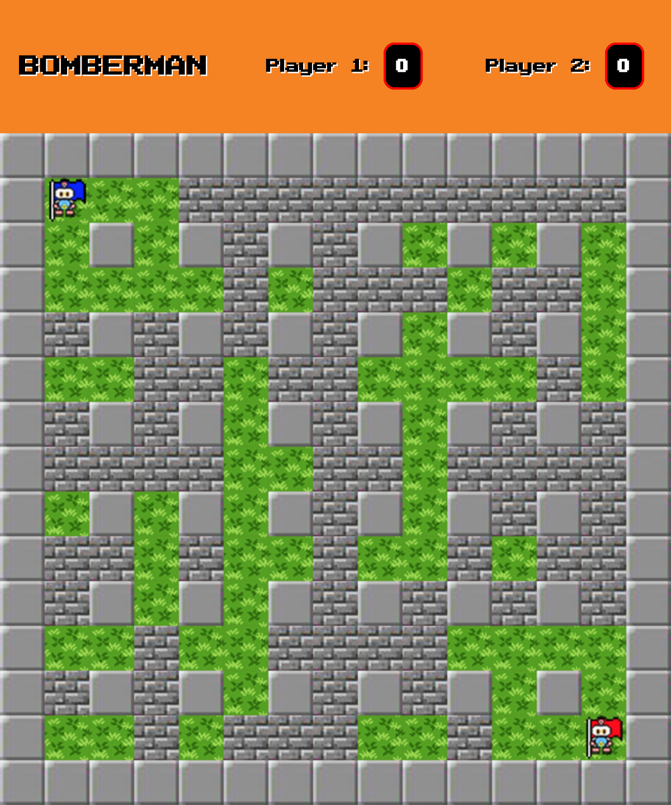

# Bomberman

[https://kevinpagtakhan.github.io/bomberman/](https://kevinpagtakhan.github.io/bomberman/ )

## Story of the Game
A was began between 2 leaders began. Each player attempts to take control of their opponent's base, identified with a flag. Both leaders are wealthy enough to carry unlimited bombs to use to navigate through the field and threaten their opponents. 

The rest of the world tries to intervene, and builds a great wall between the 2 leaders. However, this great wall isn't so great. Most of the walls are pooly built and easily destroyed with a bomb. Uh-oh!

Make sure to not let these leaders not that there are hidden power ups under the walls. Match these with their unlimited bombs and 5-round wins, they can rule the world.

### Controls

Player 1 can navigate through the field up, down, left, right using the keys W, S, A, D and drop a bomb using the spacebar. On the other hand, player 2 can do the same using the arrow keys and drop a bomb using the enter key.

## How to run locally

1. Download the zip, or clone the repo.
2. Open Terminal and navigate to the project folder.
3. Phaser.js requires a server to work locally
4. You can start the server using the Terminal and navigate to the port in your browser or you can open the project repo on [Brackets](http://brackets.io/) (text editor) and open the live view by clicking the lightning icon on the right.

## Technology Used

HTML, CSS, JavaScript, Phaser.io

The scoreboard are created, styled through HTML and CSS, and the scores are manipulated via JavaScript, depending on the game canvas events.

The game canvas was built using Phaser.io. These includes in-game prompts, action listeners, sprites, sound effects, player movement and collision detection.

## Author

* **Kevin Pagtakhan**

## Contributing
1. Fork it
2. Create your feature branch: git checkout -b new-feature
3. Commit your changes: git commit -m 'Some feature'
4. Push to your feature branch: git push origin new-feature
5. Submit a pull request

## User Stories

As a player, I have the option to click as button to start the game with a randomly generated map with power-ups.

As a player, I can use keys to move through the maze.

As a player, I can drop bombs that detonate a second after with the intent to break brick walls, capture my opponent's flag, and to hurt my opponent.

As a player, I can only drop a bomb until my last bomb explodes.

As a player, I can pick up power-up by walking through them.

As a player, I can earn points by planting a bomb on my opponent's base or when my opponent gets hit by an exploding bomb.

As a player, I can see my score through the scoreboard.

As a player, I am prompted who wins a round.

As a plaer, I am prompted who wins the game.

As a player, I can hear audio effects whenever a bombs explode, a power-up is pick-up and the round/game is over.

### Future Work

As a player, I want to have multiple lives per round.

As a player, I have the option to play on a larger field.

As a player, I can input my name to the game to see my name on the scoreboard.

As a player, I am able to pick up a wider variety of power-ups.

As a player, I want to hear a looping background music running alongside the game.

## Acknowledgments

Credits to the following:

* Original creator of bomberman game
* Owners of images and audio clips used

